Predicting Survival on the Titanic
================
David Nemirovsky & Jared Klug
5/13/21

## **EDA**

``` r
titanic_df = 
  read_csv("./data/train.csv") %>% 
  janitor::clean_names() %>% 
  mutate(survived = fct_recode(as.factor(survived), yes = "1", no = "0"), 
         survived = fct_relevel(survived, "yes", "no"),
         pclass = as.factor(pclass), 
         sex = as.factor(sex), 
         embarked = as.factor(embarked)) %>% 
  select(-c(ticket, cabin, name, passenger_id))

# Missing Data EDA:
vis_miss(titanic_df)
```

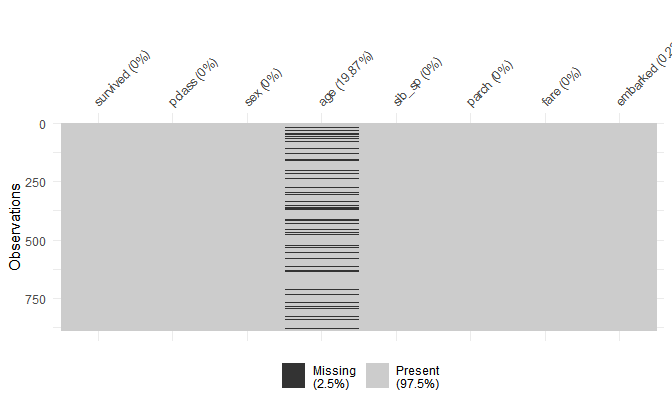

``` r
# Missing Survivals:
titanic_df %>% 
  filter(is.na(age)) %>% 
  group_by(survived) %>% 
  summarise(count = n())
```

    ## # A tibble: 2 x 2
    ##   survived count
    ##   <fct>    <int>
    ## 1 yes         52
    ## 2 no         125

``` r
# All Survivals:
titanic_df %>% 
  group_by(survived) %>% 
  summarise(count = n())
```

    ## # A tibble: 2 x 2
    ##   survived count
    ##   <fct>    <int>
    ## 1 yes        342
    ## 2 no         549

``` r
# Survival percentage in NAs is similar to actual survival rate so assume missingness is not related to outcome -> MAR.

# Bagging imputation will be used to fill in missing age data, embarked will be replaced by the most popular port "S":

titanic_df %>% 
  group_by(embarked) %>% 
  summarise(count = n())
```

    ## # A tibble: 4 x 2
    ##   embarked count
    ##   <fct>    <int>
    ## 1 C          168
    ## 2 Q           77
    ## 3 S          644
    ## 4 <NA>         2

``` r
titanic_df[is.na(titanic_df$embarked),"embarked"] = "S"

trainX = titanic_df[-1]
train_bag = preProcess(trainX, method = "bagImpute")
train_imp = predict(train_bag, trainX)
train_df = cbind(titanic_df[1], train_imp)

# Descriptive Summary Table:
eda_df = 
  train_df %>% 
  mutate(survived = fct_recode(as.factor(survived), 
                            Survived = "yes", Died = "no"),
         survived = fct_relevel(survived, "Died", "Survived"), 
         sex = fct_recode(as.factor(sex), 
                            Female = "female", Male = "male"), 
         embarked = fct_recode(as.factor(embarked), 
                               Cherbourg = "C", 
                               Queenstown = "Q", 
                               Southampton = "S"), 
         pclass = fct_recode(as.factor(pclass), 
                             Upper = "1", 
                             Middle = "2", 
                             Lower = "3"))

eda_df %>% 
  tbl_summary(by = survived, 
              label = 
                list(
                  pclass ~ "Socioeconomic Status",
                  sex ~ "Sex",
                  age ~ "Age",
                  sib_sp ~ "Number of Siblings/Spouse on Board",
                  parch ~ "Number of Parents/Children on Board",
                  fare ~ "Passenger Fare", 
                  embarked ~ "Port of Embarkation")) %>% 
  add_overall %>% 
  as_gt() %>% 
  tab_options(table.width = pct(30), table.font.size = "small")
```

<!--html_preserve-->

<style>html {
  font-family: -apple-system, BlinkMacSystemFont, 'Segoe UI', Roboto, Oxygen, Ubuntu, Cantarell, 'Helvetica Neue', 'Fira Sans', 'Droid Sans', Arial, sans-serif;
}

#xwocymlrnq .gt_table {
  display: table;
  border-collapse: collapse;
  margin-left: auto;
  margin-right: auto;
  color: #333333;
  font-size: small;
  font-weight: normal;
  font-style: normal;
  background-color: #FFFFFF;
  width: 30%;
  border-top-style: solid;
  border-top-width: 2px;
  border-top-color: #A8A8A8;
  border-right-style: none;
  border-right-width: 2px;
  border-right-color: #D3D3D3;
  border-bottom-style: solid;
  border-bottom-width: 2px;
  border-bottom-color: #A8A8A8;
  border-left-style: none;
  border-left-width: 2px;
  border-left-color: #D3D3D3;
}

#xwocymlrnq .gt_heading {
  background-color: #FFFFFF;
  text-align: center;
  border-bottom-color: #FFFFFF;
  border-left-style: none;
  border-left-width: 1px;
  border-left-color: #D3D3D3;
  border-right-style: none;
  border-right-width: 1px;
  border-right-color: #D3D3D3;
}

#xwocymlrnq .gt_title {
  color: #333333;
  font-size: 125%;
  font-weight: initial;
  padding-top: 4px;
  padding-bottom: 4px;
  border-bottom-color: #FFFFFF;
  border-bottom-width: 0;
}

#xwocymlrnq .gt_subtitle {
  color: #333333;
  font-size: 85%;
  font-weight: initial;
  padding-top: 0;
  padding-bottom: 4px;
  border-top-color: #FFFFFF;
  border-top-width: 0;
}

#xwocymlrnq .gt_bottom_border {
  border-bottom-style: solid;
  border-bottom-width: 2px;
  border-bottom-color: #D3D3D3;
}

#xwocymlrnq .gt_col_headings {
  border-top-style: solid;
  border-top-width: 2px;
  border-top-color: #D3D3D3;
  border-bottom-style: solid;
  border-bottom-width: 2px;
  border-bottom-color: #D3D3D3;
  border-left-style: none;
  border-left-width: 1px;
  border-left-color: #D3D3D3;
  border-right-style: none;
  border-right-width: 1px;
  border-right-color: #D3D3D3;
}

#xwocymlrnq .gt_col_heading {
  color: #333333;
  background-color: #FFFFFF;
  font-size: 100%;
  font-weight: normal;
  text-transform: inherit;
  border-left-style: none;
  border-left-width: 1px;
  border-left-color: #D3D3D3;
  border-right-style: none;
  border-right-width: 1px;
  border-right-color: #D3D3D3;
  vertical-align: bottom;
  padding-top: 5px;
  padding-bottom: 6px;
  padding-left: 5px;
  padding-right: 5px;
  overflow-x: hidden;
}

#xwocymlrnq .gt_column_spanner_outer {
  color: #333333;
  background-color: #FFFFFF;
  font-size: 100%;
  font-weight: normal;
  text-transform: inherit;
  padding-top: 0;
  padding-bottom: 0;
  padding-left: 4px;
  padding-right: 4px;
}

#xwocymlrnq .gt_column_spanner_outer:first-child {
  padding-left: 0;
}

#xwocymlrnq .gt_column_spanner_outer:last-child {
  padding-right: 0;
}

#xwocymlrnq .gt_column_spanner {
  border-bottom-style: solid;
  border-bottom-width: 2px;
  border-bottom-color: #D3D3D3;
  vertical-align: bottom;
  padding-top: 5px;
  padding-bottom: 6px;
  overflow-x: hidden;
  display: inline-block;
  width: 100%;
}

#xwocymlrnq .gt_group_heading {
  padding: 8px;
  color: #333333;
  background-color: #FFFFFF;
  font-size: 100%;
  font-weight: initial;
  text-transform: inherit;
  border-top-style: solid;
  border-top-width: 2px;
  border-top-color: #D3D3D3;
  border-bottom-style: solid;
  border-bottom-width: 2px;
  border-bottom-color: #D3D3D3;
  border-left-style: none;
  border-left-width: 1px;
  border-left-color: #D3D3D3;
  border-right-style: none;
  border-right-width: 1px;
  border-right-color: #D3D3D3;
  vertical-align: middle;
}

#xwocymlrnq .gt_empty_group_heading {
  padding: 0.5px;
  color: #333333;
  background-color: #FFFFFF;
  font-size: 100%;
  font-weight: initial;
  border-top-style: solid;
  border-top-width: 2px;
  border-top-color: #D3D3D3;
  border-bottom-style: solid;
  border-bottom-width: 2px;
  border-bottom-color: #D3D3D3;
  vertical-align: middle;
}

#xwocymlrnq .gt_from_md > :first-child {
  margin-top: 0;
}

#xwocymlrnq .gt_from_md > :last-child {
  margin-bottom: 0;
}

#xwocymlrnq .gt_row {
  padding-top: 8px;
  padding-bottom: 8px;
  padding-left: 5px;
  padding-right: 5px;
  margin: 10px;
  border-top-style: solid;
  border-top-width: 1px;
  border-top-color: #D3D3D3;
  border-left-style: none;
  border-left-width: 1px;
  border-left-color: #D3D3D3;
  border-right-style: none;
  border-right-width: 1px;
  border-right-color: #D3D3D3;
  vertical-align: middle;
  overflow-x: hidden;
}

#xwocymlrnq .gt_stub {
  color: #333333;
  background-color: #FFFFFF;
  font-size: 100%;
  font-weight: initial;
  text-transform: inherit;
  border-right-style: solid;
  border-right-width: 2px;
  border-right-color: #D3D3D3;
  padding-left: 12px;
}

#xwocymlrnq .gt_summary_row {
  color: #333333;
  background-color: #FFFFFF;
  text-transform: inherit;
  padding-top: 8px;
  padding-bottom: 8px;
  padding-left: 5px;
  padding-right: 5px;
}

#xwocymlrnq .gt_first_summary_row {
  padding-top: 8px;
  padding-bottom: 8px;
  padding-left: 5px;
  padding-right: 5px;
  border-top-style: solid;
  border-top-width: 2px;
  border-top-color: #D3D3D3;
}

#xwocymlrnq .gt_grand_summary_row {
  color: #333333;
  background-color: #FFFFFF;
  text-transform: inherit;
  padding-top: 8px;
  padding-bottom: 8px;
  padding-left: 5px;
  padding-right: 5px;
}

#xwocymlrnq .gt_first_grand_summary_row {
  padding-top: 8px;
  padding-bottom: 8px;
  padding-left: 5px;
  padding-right: 5px;
  border-top-style: double;
  border-top-width: 6px;
  border-top-color: #D3D3D3;
}

#xwocymlrnq .gt_striped {
  background-color: rgba(128, 128, 128, 0.05);
}

#xwocymlrnq .gt_table_body {
  border-top-style: solid;
  border-top-width: 2px;
  border-top-color: #D3D3D3;
  border-bottom-style: solid;
  border-bottom-width: 2px;
  border-bottom-color: #D3D3D3;
}

#xwocymlrnq .gt_footnotes {
  color: #333333;
  background-color: #FFFFFF;
  border-bottom-style: none;
  border-bottom-width: 2px;
  border-bottom-color: #D3D3D3;
  border-left-style: none;
  border-left-width: 2px;
  border-left-color: #D3D3D3;
  border-right-style: none;
  border-right-width: 2px;
  border-right-color: #D3D3D3;
}

#xwocymlrnq .gt_footnote {
  margin: 0px;
  font-size: 90%;
  padding: 4px;
}

#xwocymlrnq .gt_sourcenotes {
  color: #333333;
  background-color: #FFFFFF;
  border-bottom-style: none;
  border-bottom-width: 2px;
  border-bottom-color: #D3D3D3;
  border-left-style: none;
  border-left-width: 2px;
  border-left-color: #D3D3D3;
  border-right-style: none;
  border-right-width: 2px;
  border-right-color: #D3D3D3;
}

#xwocymlrnq .gt_sourcenote {
  font-size: 90%;
  padding: 4px;
}

#xwocymlrnq .gt_left {
  text-align: left;
}

#xwocymlrnq .gt_center {
  text-align: center;
}

#xwocymlrnq .gt_right {
  text-align: right;
  font-variant-numeric: tabular-nums;
}

#xwocymlrnq .gt_font_normal {
  font-weight: normal;
}

#xwocymlrnq .gt_font_bold {
  font-weight: bold;
}

#xwocymlrnq .gt_font_italic {
  font-style: italic;
}

#xwocymlrnq .gt_super {
  font-size: 65%;
}

#xwocymlrnq .gt_footnote_marks {
  font-style: italic;
  font-size: 65%;
}
</style>

<div id="xwocymlrnq" style="overflow-x:auto;overflow-y:auto;width:auto;height:auto;">

<table class="gt_table">

<thead class="gt_col_headings">

<tr>

<th class="gt_col_heading gt_columns_bottom_border gt_left" rowspan="1" colspan="1">

<strong>Characteristic</strong>

</th>

<th class="gt_col_heading gt_columns_bottom_border gt_center" rowspan="1" colspan="1">

<strong>Overall</strong>, N = 891<sup class="gt_footnote_marks">1</sup>

</th>

<th class="gt_col_heading gt_columns_bottom_border gt_center" rowspan="1" colspan="1">

<strong>Died</strong>, N = 549<sup class="gt_footnote_marks">1</sup>

</th>

<th class="gt_col_heading gt_columns_bottom_border gt_center" rowspan="1" colspan="1">

<strong>Survived</strong>, N = 342<sup class="gt_footnote_marks">1</sup>

</th>

</tr>

</thead>

<tbody class="gt_table_body">

<tr>

<td class="gt_row gt_left">

Socioeconomic Status

</td>

<td class="gt_row gt_center">

</td>

<td class="gt_row gt_center">

</td>

<td class="gt_row gt_center">

</td>

</tr>

<tr>

<td class="gt_row gt_left" style="text-align: left; text-indent: 10px;">

Upper

</td>

<td class="gt_row gt_center">

216 (24%)

</td>

<td class="gt_row gt_center">

80 (15%)

</td>

<td class="gt_row gt_center">

136 (40%)

</td>

</tr>

<tr>

<td class="gt_row gt_left" style="text-align: left; text-indent: 10px;">

Middle

</td>

<td class="gt_row gt_center">

184 (21%)

</td>

<td class="gt_row gt_center">

97 (18%)

</td>

<td class="gt_row gt_center">

87 (25%)

</td>

</tr>

<tr>

<td class="gt_row gt_left" style="text-align: left; text-indent: 10px;">

Lower

</td>

<td class="gt_row gt_center">

491 (55%)

</td>

<td class="gt_row gt_center">

372 (68%)

</td>

<td class="gt_row gt_center">

119 (35%)

</td>

</tr>

<tr>

<td class="gt_row gt_left">

Sex

</td>

<td class="gt_row gt_center">

</td>

<td class="gt_row gt_center">

</td>

<td class="gt_row gt_center">

</td>

</tr>

<tr>

<td class="gt_row gt_left" style="text-align: left; text-indent: 10px;">

Female

</td>

<td class="gt_row gt_center">

314 (35%)

</td>

<td class="gt_row gt_center">

81 (15%)

</td>

<td class="gt_row gt_center">

233 (68%)

</td>

</tr>

<tr>

<td class="gt_row gt_left" style="text-align: left; text-indent: 10px;">

Male

</td>

<td class="gt_row gt_center">

577 (65%)

</td>

<td class="gt_row gt_center">

468 (85%)

</td>

<td class="gt_row gt_center">

109 (32%)

</td>

</tr>

<tr>

<td class="gt_row gt_left">

Age

</td>

<td class="gt_row gt_center">

28 (22, 36)

</td>

<td class="gt_row gt_center">

29 (22, 36)

</td>

<td class="gt_row gt_center">

28 (20, 36)

</td>

</tr>

<tr>

<td class="gt_row gt_left">

Number of Siblings/Spouse on Board

</td>

<td class="gt_row gt_center">

</td>

<td class="gt_row gt_center">

</td>

<td class="gt_row gt_center">

</td>

</tr>

<tr>

<td class="gt_row gt_left" style="text-align: left; text-indent: 10px;">

0

</td>

<td class="gt_row gt_center">

608 (68%)

</td>

<td class="gt_row gt_center">

398 (72%)

</td>

<td class="gt_row gt_center">

210 (61%)

</td>

</tr>

<tr>

<td class="gt_row gt_left" style="text-align: left; text-indent: 10px;">

1

</td>

<td class="gt_row gt_center">

209 (23%)

</td>

<td class="gt_row gt_center">

97 (18%)

</td>

<td class="gt_row gt_center">

112 (33%)

</td>

</tr>

<tr>

<td class="gt_row gt_left" style="text-align: left; text-indent: 10px;">

2

</td>

<td class="gt_row gt_center">

28 (3.1%)

</td>

<td class="gt_row gt_center">

15 (2.7%)

</td>

<td class="gt_row gt_center">

13 (3.8%)

</td>

</tr>

<tr>

<td class="gt_row gt_left" style="text-align: left; text-indent: 10px;">

3

</td>

<td class="gt_row gt_center">

16 (1.8%)

</td>

<td class="gt_row gt_center">

12 (2.2%)

</td>

<td class="gt_row gt_center">

4 (1.2%)

</td>

</tr>

<tr>

<td class="gt_row gt_left" style="text-align: left; text-indent: 10px;">

4

</td>

<td class="gt_row gt_center">

18 (2.0%)

</td>

<td class="gt_row gt_center">

15 (2.7%)

</td>

<td class="gt_row gt_center">

3 (0.9%)

</td>

</tr>

<tr>

<td class="gt_row gt_left" style="text-align: left; text-indent: 10px;">

5

</td>

<td class="gt_row gt_center">

5 (0.6%)

</td>

<td class="gt_row gt_center">

5 (0.9%)

</td>

<td class="gt_row gt_center">

0 (0%)

</td>

</tr>

<tr>

<td class="gt_row gt_left" style="text-align: left; text-indent: 10px;">

8

</td>

<td class="gt_row gt_center">

7 (0.8%)

</td>

<td class="gt_row gt_center">

7 (1.3%)

</td>

<td class="gt_row gt_center">

0 (0%)

</td>

</tr>

<tr>

<td class="gt_row gt_left">

Number of Parents/Children on Board

</td>

<td class="gt_row gt_center">

</td>

<td class="gt_row gt_center">

</td>

<td class="gt_row gt_center">

</td>

</tr>

<tr>

<td class="gt_row gt_left" style="text-align: left; text-indent: 10px;">

0

</td>

<td class="gt_row gt_center">

678 (76%)

</td>

<td class="gt_row gt_center">

445 (81%)

</td>

<td class="gt_row gt_center">

233 (68%)

</td>

</tr>

<tr>

<td class="gt_row gt_left" style="text-align: left; text-indent: 10px;">

1

</td>

<td class="gt_row gt_center">

118 (13%)

</td>

<td class="gt_row gt_center">

53 (9.7%)

</td>

<td class="gt_row gt_center">

65 (19%)

</td>

</tr>

<tr>

<td class="gt_row gt_left" style="text-align: left; text-indent: 10px;">

2

</td>

<td class="gt_row gt_center">

80 (9.0%)

</td>

<td class="gt_row gt_center">

40 (7.3%)

</td>

<td class="gt_row gt_center">

40 (12%)

</td>

</tr>

<tr>

<td class="gt_row gt_left" style="text-align: left; text-indent: 10px;">

3

</td>

<td class="gt_row gt_center">

5 (0.6%)

</td>

<td class="gt_row gt_center">

2 (0.4%)

</td>

<td class="gt_row gt_center">

3 (0.9%)

</td>

</tr>

<tr>

<td class="gt_row gt_left" style="text-align: left; text-indent: 10px;">

4

</td>

<td class="gt_row gt_center">

4 (0.4%)

</td>

<td class="gt_row gt_center">

4 (0.7%)

</td>

<td class="gt_row gt_center">

0 (0%)

</td>

</tr>

<tr>

<td class="gt_row gt_left" style="text-align: left; text-indent: 10px;">

5

</td>

<td class="gt_row gt_center">

5 (0.6%)

</td>

<td class="gt_row gt_center">

4 (0.7%)

</td>

<td class="gt_row gt_center">

1 (0.3%)

</td>

</tr>

<tr>

<td class="gt_row gt_left" style="text-align: left; text-indent: 10px;">

6

</td>

<td class="gt_row gt_center">

1 (0.1%)

</td>

<td class="gt_row gt_center">

1 (0.2%)

</td>

<td class="gt_row gt_center">

0 (0%)

</td>

</tr>

<tr>

<td class="gt_row gt_left">

Passenger Fare

</td>

<td class="gt_row gt_center">

14 (8, 31)

</td>

<td class="gt_row gt_center">

10 (8, 26)

</td>

<td class="gt_row gt_center">

26 (12, 57)

</td>

</tr>

<tr>

<td class="gt_row gt_left">

Port of Embarkation

</td>

<td class="gt_row gt_center">

</td>

<td class="gt_row gt_center">

</td>

<td class="gt_row gt_center">

</td>

</tr>

<tr>

<td class="gt_row gt_left" style="text-align: left; text-indent: 10px;">

Cherbourg

</td>

<td class="gt_row gt_center">

168 (19%)

</td>

<td class="gt_row gt_center">

75 (14%)

</td>

<td class="gt_row gt_center">

93 (27%)

</td>

</tr>

<tr>

<td class="gt_row gt_left" style="text-align: left; text-indent: 10px;">

Queenstown

</td>

<td class="gt_row gt_center">

77 (8.6%)

</td>

<td class="gt_row gt_center">

47 (8.6%)

</td>

<td class="gt_row gt_center">

30 (8.8%)

</td>

</tr>

<tr>

<td class="gt_row gt_left" style="text-align: left; text-indent: 10px;">

Southampton

</td>

<td class="gt_row gt_center">

646 (73%)

</td>

<td class="gt_row gt_center">

427 (78%)

</td>

<td class="gt_row gt_center">

219 (64%)

</td>

</tr>

</tbody>

<tfoot>

<tr class="gt_footnotes">

<td colspan="4">

<p class="gt_footnote">

<sup class="gt_footnote_marks"> <em>1</em> </sup>

Statistics presented: n (%); Median (IQR) <br />

</p>

</td>

</tr>

</tfoot>

</table>

</div>

<!--/html_preserve-->

``` r
# Examine skew and outliers of some predictors: 
eda_df %>% 
  ggplot(aes(x = fare)) + 
  geom_density()
```

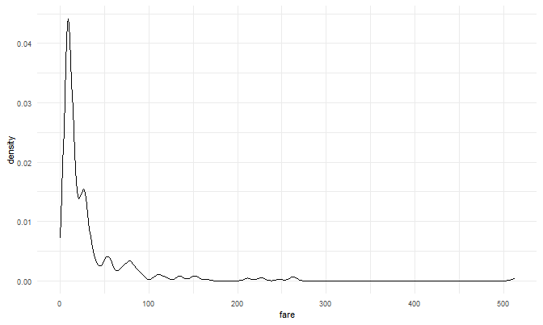

``` r
eda_df %>% 
  ggplot(aes(x = sib_sp)) + 
  geom_density()
```

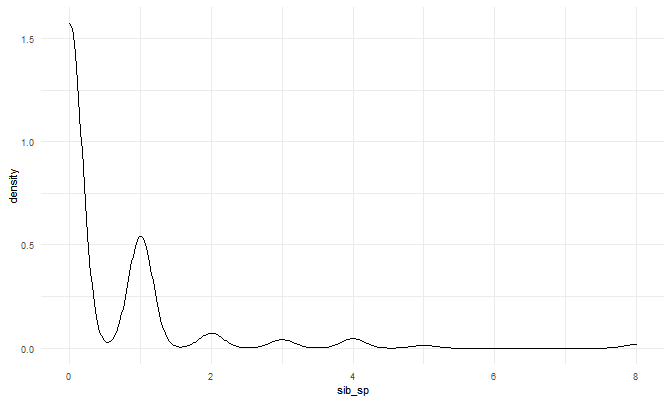

``` r
eda_df %>% 
  ggplot(aes(x = parch)) + 
  geom_density()
```

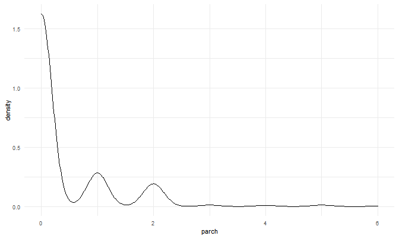

``` r
# Survival by Age:
plot_age = 
  eda_df %>% 
  ggplot(aes(x = age, fill = survived)) +
  geom_density(alpha = 0.75) +
  labs(x = "Age", y = "Density") +
  scale_fill_discrete(name = "Survived") + 
  theme(legend.title = element_blank())

# Survival by Fare:
plot_fare = 
  eda_df %>% 
  filter(fare < 100) %>% 
  ggplot(aes(x = fare, fill = survived)) +
  geom_density(alpha = 0.75) +
  labs(x = "Fare", y = "Density") +
  scale_fill_discrete(name = "Survived") + 
  theme(legend.title = element_blank())

# Survival by Number of Siblings/Spouse:
plot_sibsp = 
  eda_df %>% 
  filter(sib_sp < 5) %>% 
  ggplot(aes(x = sib_sp, fill = survived)) +
  geom_density(alpha = 0.75) +
  labs(x = "Number of Siblings/Spouse", y = "Density") +
  scale_fill_discrete(name = "Survived") + 
  theme(legend.title = element_blank())

# Survival by Number of Parents/Children:
plot_parch = 
  eda_df %>% 
  filter(parch < 4) %>% 
  ggplot(aes(x = parch, fill = survived)) +
  geom_density(alpha = 0.75) +
  labs(x = "Number of Parents/Children", y = "Density") +
  scale_fill_discrete(name = "Survived") + 
  theme(legend.title = element_blank())

# Survival by Sex:
plot_sex = 
  eda_df %>% 
  ggplot(aes(x = sex, fill = survived)) +
  geom_bar(color = "black", alpha = 0.75) +
  labs(x = "Sex", y = "Count") +
  scale_fill_discrete(name = "Survived") + 
  theme(legend.title = element_blank())

# Survival by Socioeconomic Status:
plot_pclass = 
  eda_df %>% 
  ggplot(aes(x = pclass, fill = survived)) +
  geom_bar(color = "black", alpha = 0.75) + 
  labs(x = "Socioeconomic Status", y = "Count") +
  scale_fill_discrete(name = "Survived") + 
  theme(legend.title = element_blank())

# Survival by Port of Embarkation:
plot_emb = 
  eda_df %>% 
  ggplot(aes(x = embarked, fill = survived)) +
  geom_bar(color = "black", alpha = 0.75) + 
  labs(x = "Port of Embarkation", y = "Count") +
  scale_fill_discrete(name = "Survived") + 
  theme(legend.title = element_blank())

layout = "
AAABBB
CCCDDD
EEFFGG
"
plot_age + plot_fare + plot_sibsp + plot_parch + plot_sex + 
  plot_pclass + plot_emb + plot_layout(design = layout, guides = "collect")
```

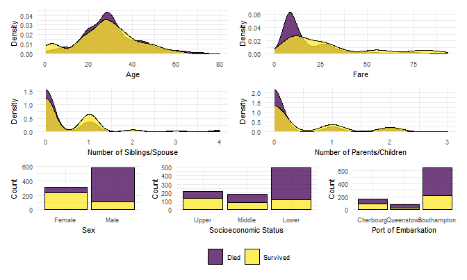

``` r
# Survival of Age vs Fare by SES and Sex
eda_df %>% 
  filter(fare < 100) %>% 
  ggplot(aes(x = age, y = fare, color = survived)) +
  geom_point(alpha = 0.75) + 
  facet_grid(sex ~ pclass) + 
  labs(x = "Age", y = "Fare") +
  scale_color_discrete(name = "Survived")
```

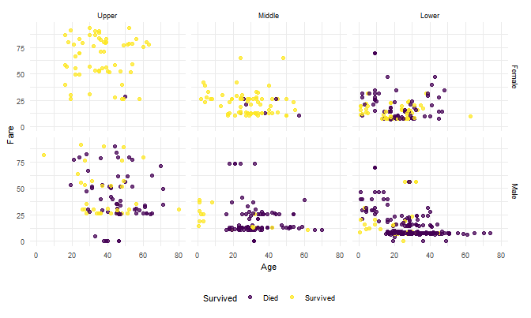

``` r
# Survival of Age vs Fare by Embarkation and Sex
eda_df %>% 
  filter(fare < 100) %>% 
  ggplot(aes(x = age, y = fare, color = survived)) +
  geom_point(alpha = 0.75) + 
  facet_grid(sex ~ embarked) + 
  labs(x = "Age", y = "Fare") +
  scale_color_discrete(name = "Survived")
```

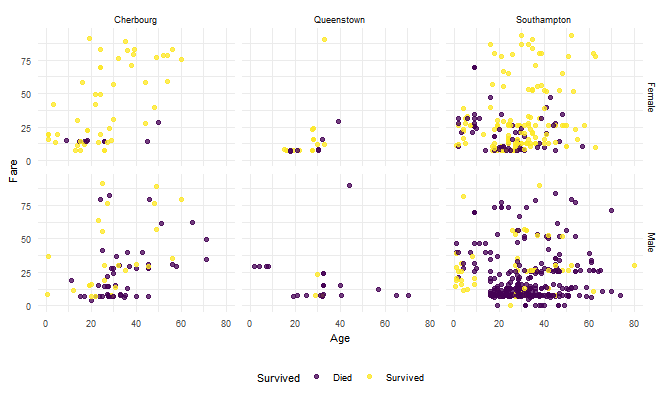

## **Model Training**

``` r
ctrl = trainControl(method = "repeatedcv", summaryFunction = twoClassSummary, classProbs = T, number = 10, repeats = 5)

set.seed(37564)
mod_enet = train(survived ~ .,
                 na.action = na.exclude, 
                 data = train_df, 
                 method = "glmnet", 
                 family = "binomial", 
                 metric = "ROC", 
                 tuneGrid = expand.grid(alpha = seq(0, 0.5, length = 6), 
                                        lambda = exp(seq(-4, -8, length = 50))),
                 trControl = ctrl)
tuning_plot_enet = 
  ggplot(mod_enet, highlight = T) + 
  ggtitle("Elastic Net") +
  theme(plot.title = element_text(hjust = 0.5))
mod_enet$bestTune
```

    ##     alpha      lambda
    ## 165   0.3 0.001051915

``` r
set.seed(37564)
mod_mars = train(survived ~ ., 
                 na.action = na.exclude, 
                 data = train_df, 
                 method = "earth",
                 tuneGrid = expand.grid(degree = 1:3, nprune = 5:15), 
                 metric = "ROC", 
                 trControl = ctrl)
tuning_plot_mars = 
  ggplot(mod_mars, highlight = T) + 
  ggtitle("MARS") +
  theme(plot.title = element_text(hjust = 0.5))
mod_mars$bestTune
```

    ##    nprune degree
    ## 18     11      2

``` r
set.seed(37564)
mod_knn = train(survived ~ .,
                na.action = na.exclude, 
                data = train_df, 
                method = "knn",
                metric = "ROC", 
                preProcess = c("center","scale"),
                tuneGrid = data.frame(k = seq(1, 30, by = 1)), 
                trControl = ctrl)
tuning_plot_knn = 
  ggplot(mod_knn, highlight = T) + 
  ggtitle("KNN") +
  theme(plot.title = element_text(hjust = 0.5))
mod_knn$bestTune
```

    ##   k
    ## 8 8

``` r
set.seed(37564)
mod_boost = train(survived ~ .,
                  na.action = na.exclude,
                  data = train_df,
                  method = "gbm",
                  distribution = "adaboost",
                  tuneGrid = expand.grid(n.trees = c(2000, 3000),
                                         interaction.depth = 4:13,
                                         shrinkage = c(0.003, 0.005, 0.007), 
                                         n.minobsinnode = 1),
                  metric = "ROC",
                  trControl = ctrl,
                  verbose = F)
tuning_plot_boost = 
  ggplot(mod_boost, highlight = T) + 
  ggtitle("Boosting") +
  theme(plot.title = element_text(hjust = 0.5))
mod_boost$bestTune
```

    ##    n.trees interaction.depth shrinkage n.minobsinnode
    ## 35    2000                11     0.005              1

``` r
set.seed(37564)
mod_svm = train(survived ~ .,
                na.action = na.exclude,
                data = train_df,
                preProcess = c("scale", "center"),
                method = "svmRadialSigma",
                tuneGrid = expand.grid(C = exp(seq(-2,3, len = 10)),
                                       sigma = exp(seq(-8,0, len = 10))),
                metric = "ROC",
                trControl = ctrl)
tuning_plot_svm = 
  ggplot(mod_svm, highlight = T) + 
  ggtitle("SVM Radial") +
  theme(plot.title = element_text(hjust = 0.5))
mod_svm$bestTune
```

    ##        sigma        C
    ## 76 0.0285655 6.612018

``` r
layout2 = "
AABB
CCDD
EEEE
"
tuning_plot_knn + tuning_plot_enet + 
  tuning_plot_mars + tuning_plot_svm + 
  tuning_plot_boost + plot_layout(design = layout2)
```

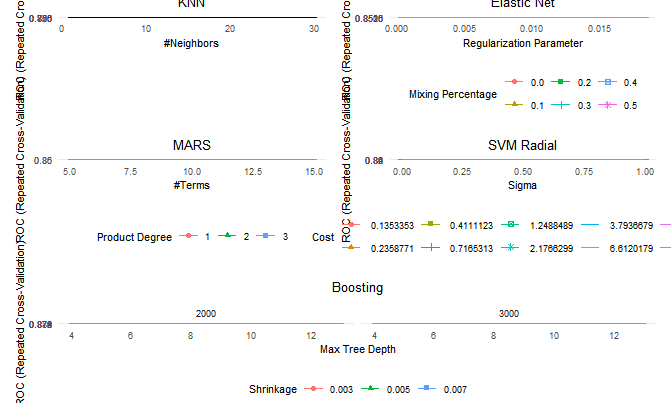

``` r
res = resamples(list(ENET = mod_enet, MARS = mod_mars, KNN = mod_knn, BOOST = mod_boost, SVM = mod_svm))
summary(res)
```

    ## 
    ## Call:
    ## summary.resamples(object = res)
    ## 
    ## Models: ENET, MARS, KNN, BOOST, SVM 
    ## Number of resamples: 50 
    ## 
    ## ROC 
    ##            Min.   1st Qu.    Median      Mean   3rd Qu.      Max. NA's
    ## ENET  0.7545455 0.8311497 0.8562834 0.8523355 0.8815699 0.9208556    0
    ## MARS  0.7804813 0.8408709 0.8704793 0.8659702 0.8903839 0.9415584    0
    ## KNN   0.8080214 0.8431723 0.8644038 0.8685563 0.8882659 0.9532086    0
    ## BOOST 0.8042781 0.8617647 0.8788770 0.8803538 0.9021314 0.9524064    0
    ## SVM   0.7818182 0.8322193 0.8626560 0.8603469 0.8816176 0.9294118    0
    ## 
    ## Sens 
    ##            Min.   1st Qu.    Median      Mean   3rd Qu.      Max. NA's
    ## ENET  0.5588235 0.6619748 0.7058824 0.7052437 0.7409664 0.8529412    0
    ## MARS  0.5882353 0.6764706 0.7058824 0.7156975 0.7714286 0.9117647    0
    ## KNN   0.5428571 0.6470588 0.7058824 0.7083529 0.7647059 0.8823529    0
    ## BOOST 0.5588235 0.6544118 0.7058824 0.7124034 0.7647059 0.9117647    0
    ## SVM   0.4705882 0.6176471 0.6764706 0.6625546 0.7058824 0.8529412    0
    ## 
    ## Spec 
    ##            Min.   1st Qu.    Median      Mean   3rd Qu.      Max. NA's
    ## ENET  0.8000000 0.8363636 0.8727273 0.8648418 0.8909091 0.9454545    0
    ## MARS  0.6909091 0.8363636 0.8727273 0.8692054 0.8909091 0.9636364    0
    ## KNN   0.7777778 0.8545455 0.8909091 0.8815623 0.9090909 0.9636364    0
    ## BOOST 0.8000000 0.8727273 0.9090909 0.9052795 0.9454545 0.9636364    0
    ## SVM   0.8545455 0.9090909 0.9272727 0.9242290 0.9454545 1.0000000    0

``` r
bwplot(res, metric = "ROC", main = "ROC for Repeated 10-Fold CV Using Various Models")
```

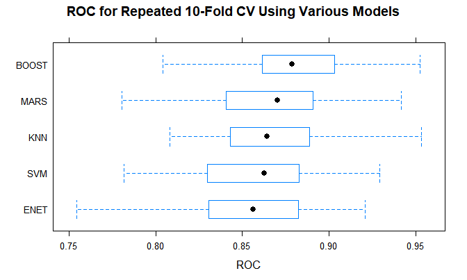

## **Variable Importance**

``` r
set.seed(37564)
vip(mod_boost, 
    method = "permute", 
    train = train_df,
    target = "survived",
    metric = "auc",
    reference_class = c("no", "yes"),
    nsim = 30,
    pred_wrapper = predict,
    geom = "boxplot", 
    all_permutations = T,
    mapping = aes_string(fill = "Variable", alpha = 0.75))
```

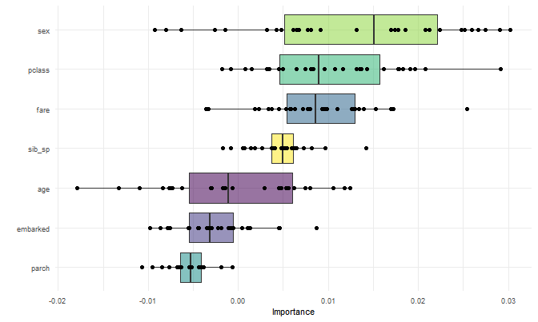

``` r
# Check if ENET parameters mocks importance pattern
coef(mod_enet$finalModel, mod_enet$bestTune$lambda)
```

    ## 10 x 1 sparse Matrix of class "dgCMatrix"
    ##                        1
    ## (Intercept) -4.209638353
    ## pclass2      1.018755246
    ## pclass3      2.276636897
    ## sexmale      2.664609147
    ## age          0.040746141
    ## sib_sp       0.358907155
    ## parch        0.096550464
    ## fare        -0.001996118
    ## embarkedQ   -0.001246108
    ## embarkedS    0.406549532

## **Predictions**

``` r
testna_df = 
  read_csv("./data/test.csv") %>% 
  janitor::clean_names() %>% 
  select(-c(ticket, cabin, name)) %>% 
  left_join(janitor::clean_names(read_csv("./data/titanic_results.csv"))) %>%
  mutate(pclass = as.factor(pclass), 
         sex = as.factor(sex), 
         embarked = as.factor(embarked))

testX = testna_df[,2:8]
test_bag = preProcess(testX, method = "bagImpute")
test_df = predict(test_bag, testX) %>% 
  cbind(testna_df[1], testna_df[9])

pred_boost = predict(mod_boost, newdata = test_df, type = "prob")[,1]
roc_boost = roc(test_df$survived, pred_boost)
plot(roc_boost, legacy.axes = T, print.auc = T)
```

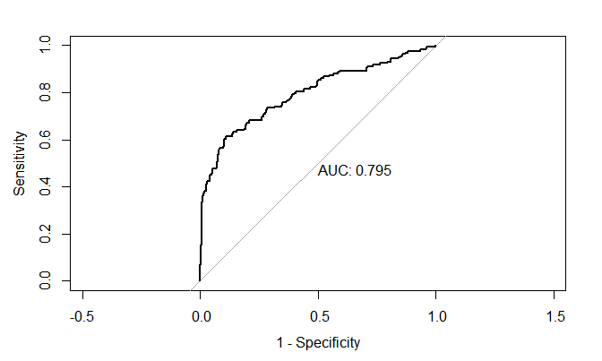

## **AdaBoost Model Analysis**

``` r
cm_df = pred_boost %>% 
  as.data.frame() %>% 
  rename("survived" = ".") %>% 
  mutate(survived = as.factor(ifelse(survived >= 0.5, 1, 0)))
  
confusionMatrix(data = cm_df$survived, reference = as.factor(test_df$survived))
```

    ## Confusion Matrix and Statistics
    ## 
    ##           Reference
    ## Prediction   0   1
    ##          0 221  58
    ##          1  39 100
    ##                                           
    ##                Accuracy : 0.7679          
    ##                  95% CI : (0.7245, 0.8076)
    ##     No Information Rate : 0.622           
    ##     P-Value [Acc > NIR] : 1.342e-10       
    ##                                           
    ##                   Kappa : 0.4946          
    ##                                           
    ##  Mcnemar's Test P-Value : 0.06761         
    ##                                           
    ##             Sensitivity : 0.8500          
    ##             Specificity : 0.6329          
    ##          Pos Pred Value : 0.7921          
    ##          Neg Pred Value : 0.7194          
    ##              Prevalence : 0.6220          
    ##          Detection Rate : 0.5287          
    ##    Detection Prevalence : 0.6675          
    ##       Balanced Accuracy : 0.7415          
    ##                                           
    ##        'Positive' Class : 0               
    ## 

``` r
pdp_age = 
  mod_boost %>% 
  partial(pred.var = c("age")) %>%
  autoplot(train = train_df, rug = TRUE)

pdp_fare = 
  mod_boost %>% 
  partial(pred.var = c("fare")) %>%
  autoplot(train = train_df, rug = TRUE)

pdp_sibsp = 
  mod_boost %>% 
  partial(pred.var = c("sib_sp")) %>%
  autoplot(train = train_df, rug = TRUE)

pdp_parch = 
  mod_boost %>% 
  partial(pred.var = c("parch")) %>%
  autoplot(train = train_df, rug = TRUE)

grid.arrange(pdp_age, pdp_fare, pdp_sibsp, pdp_parch, nrow = 2)
```


``` r
mod_boost %>% 
  partial(pred.var = c("sib_sp", "fare")) %>%
  autoplot(train = train_df, rug = TRUE)
```


``` r
mod_boost %>% 
  partial(pred.var = c("age", "fare")) %>%
  autoplot(train = train_df, rug = TRUE)
```


``` r
explainer = lime(train_df[, -1], mod_boost)
set.seed(15236)
new_obs = test_df[sample(418, 6), -c(8:9)]
explanation = lime::explain(new_obs,
                            explainer, 
                            n_labels = 1, 
                            n_features = 7)
plot_features(explanation)
```


``` r
plot_explanations(explanation)
```


## **Kaggle Competition Submission**

``` r
test_id = testna_df$passenger_id

test_res = 
  pred_boost %>% 
  as.data.frame() %>% 
  mutate(survived = ifelse(pred_boost >= 0.5, 1, 0))

submission = 
  cbind(test_id, test_res$survived) %>% 
  as.data.frame() %>% 
  rename(PassengerId = test_id,
         Survived = V2)

write_csv(submission, "submission.csv")
```
