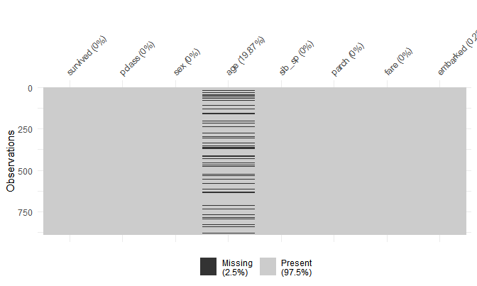
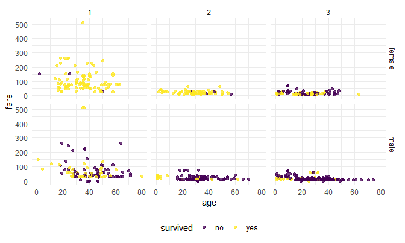
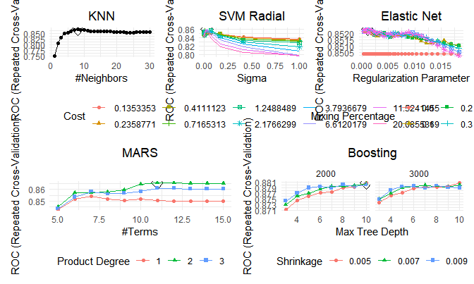

Final Project
================
David Nemirovsky & Jared Klug
5/13/21

## **EDA**

``` r
titanic_df = 
  read_csv("./data/train.csv") %>% 
  janitor::clean_names() %>% 
  mutate(survived = fct_recode(as.factor(survived), yes = "1", no = "0"), 
         pclass = as.factor(pclass), 
         sex = as.factor(sex), 
         embarked = as.factor(embarked))

train_df = 
  titanic_df %>% 
  select(-c(ticket, cabin, name, passenger_id)) %>% 
  drop_na()

tbl_summary(train_df)
```

<!--html_preserve-->

<style>html {
  font-family: -apple-system, BlinkMacSystemFont, 'Segoe UI', Roboto, Oxygen, Ubuntu, Cantarell, 'Helvetica Neue', 'Fira Sans', 'Droid Sans', Arial, sans-serif;
}

#sqaumxajvs .gt_table {
  display: table;
  border-collapse: collapse;
  margin-left: auto;
  margin-right: auto;
  color: #333333;
  font-size: 16px;
  font-weight: normal;
  font-style: normal;
  background-color: #FFFFFF;
  width: auto;
  border-top-style: solid;
  border-top-width: 2px;
  border-top-color: #A8A8A8;
  border-right-style: none;
  border-right-width: 2px;
  border-right-color: #D3D3D3;
  border-bottom-style: solid;
  border-bottom-width: 2px;
  border-bottom-color: #A8A8A8;
  border-left-style: none;
  border-left-width: 2px;
  border-left-color: #D3D3D3;
}

#sqaumxajvs .gt_heading {
  background-color: #FFFFFF;
  text-align: center;
  border-bottom-color: #FFFFFF;
  border-left-style: none;
  border-left-width: 1px;
  border-left-color: #D3D3D3;
  border-right-style: none;
  border-right-width: 1px;
  border-right-color: #D3D3D3;
}

#sqaumxajvs .gt_title {
  color: #333333;
  font-size: 125%;
  font-weight: initial;
  padding-top: 4px;
  padding-bottom: 4px;
  border-bottom-color: #FFFFFF;
  border-bottom-width: 0;
}

#sqaumxajvs .gt_subtitle {
  color: #333333;
  font-size: 85%;
  font-weight: initial;
  padding-top: 0;
  padding-bottom: 4px;
  border-top-color: #FFFFFF;
  border-top-width: 0;
}

#sqaumxajvs .gt_bottom_border {
  border-bottom-style: solid;
  border-bottom-width: 2px;
  border-bottom-color: #D3D3D3;
}

#sqaumxajvs .gt_col_headings {
  border-top-style: solid;
  border-top-width: 2px;
  border-top-color: #D3D3D3;
  border-bottom-style: solid;
  border-bottom-width: 2px;
  border-bottom-color: #D3D3D3;
  border-left-style: none;
  border-left-width: 1px;
  border-left-color: #D3D3D3;
  border-right-style: none;
  border-right-width: 1px;
  border-right-color: #D3D3D3;
}

#sqaumxajvs .gt_col_heading {
  color: #333333;
  background-color: #FFFFFF;
  font-size: 100%;
  font-weight: normal;
  text-transform: inherit;
  border-left-style: none;
  border-left-width: 1px;
  border-left-color: #D3D3D3;
  border-right-style: none;
  border-right-width: 1px;
  border-right-color: #D3D3D3;
  vertical-align: bottom;
  padding-top: 5px;
  padding-bottom: 6px;
  padding-left: 5px;
  padding-right: 5px;
  overflow-x: hidden;
}

#sqaumxajvs .gt_column_spanner_outer {
  color: #333333;
  background-color: #FFFFFF;
  font-size: 100%;
  font-weight: normal;
  text-transform: inherit;
  padding-top: 0;
  padding-bottom: 0;
  padding-left: 4px;
  padding-right: 4px;
}

#sqaumxajvs .gt_column_spanner_outer:first-child {
  padding-left: 0;
}

#sqaumxajvs .gt_column_spanner_outer:last-child {
  padding-right: 0;
}

#sqaumxajvs .gt_column_spanner {
  border-bottom-style: solid;
  border-bottom-width: 2px;
  border-bottom-color: #D3D3D3;
  vertical-align: bottom;
  padding-top: 5px;
  padding-bottom: 6px;
  overflow-x: hidden;
  display: inline-block;
  width: 100%;
}

#sqaumxajvs .gt_group_heading {
  padding: 8px;
  color: #333333;
  background-color: #FFFFFF;
  font-size: 100%;
  font-weight: initial;
  text-transform: inherit;
  border-top-style: solid;
  border-top-width: 2px;
  border-top-color: #D3D3D3;
  border-bottom-style: solid;
  border-bottom-width: 2px;
  border-bottom-color: #D3D3D3;
  border-left-style: none;
  border-left-width: 1px;
  border-left-color: #D3D3D3;
  border-right-style: none;
  border-right-width: 1px;
  border-right-color: #D3D3D3;
  vertical-align: middle;
}

#sqaumxajvs .gt_empty_group_heading {
  padding: 0.5px;
  color: #333333;
  background-color: #FFFFFF;
  font-size: 100%;
  font-weight: initial;
  border-top-style: solid;
  border-top-width: 2px;
  border-top-color: #D3D3D3;
  border-bottom-style: solid;
  border-bottom-width: 2px;
  border-bottom-color: #D3D3D3;
  vertical-align: middle;
}

#sqaumxajvs .gt_from_md > :first-child {
  margin-top: 0;
}

#sqaumxajvs .gt_from_md > :last-child {
  margin-bottom: 0;
}

#sqaumxajvs .gt_row {
  padding-top: 8px;
  padding-bottom: 8px;
  padding-left: 5px;
  padding-right: 5px;
  margin: 10px;
  border-top-style: solid;
  border-top-width: 1px;
  border-top-color: #D3D3D3;
  border-left-style: none;
  border-left-width: 1px;
  border-left-color: #D3D3D3;
  border-right-style: none;
  border-right-width: 1px;
  border-right-color: #D3D3D3;
  vertical-align: middle;
  overflow-x: hidden;
}

#sqaumxajvs .gt_stub {
  color: #333333;
  background-color: #FFFFFF;
  font-size: 100%;
  font-weight: initial;
  text-transform: inherit;
  border-right-style: solid;
  border-right-width: 2px;
  border-right-color: #D3D3D3;
  padding-left: 12px;
}

#sqaumxajvs .gt_summary_row {
  color: #333333;
  background-color: #FFFFFF;
  text-transform: inherit;
  padding-top: 8px;
  padding-bottom: 8px;
  padding-left: 5px;
  padding-right: 5px;
}

#sqaumxajvs .gt_first_summary_row {
  padding-top: 8px;
  padding-bottom: 8px;
  padding-left: 5px;
  padding-right: 5px;
  border-top-style: solid;
  border-top-width: 2px;
  border-top-color: #D3D3D3;
}

#sqaumxajvs .gt_grand_summary_row {
  color: #333333;
  background-color: #FFFFFF;
  text-transform: inherit;
  padding-top: 8px;
  padding-bottom: 8px;
  padding-left: 5px;
  padding-right: 5px;
}

#sqaumxajvs .gt_first_grand_summary_row {
  padding-top: 8px;
  padding-bottom: 8px;
  padding-left: 5px;
  padding-right: 5px;
  border-top-style: double;
  border-top-width: 6px;
  border-top-color: #D3D3D3;
}

#sqaumxajvs .gt_striped {
  background-color: rgba(128, 128, 128, 0.05);
}

#sqaumxajvs .gt_table_body {
  border-top-style: solid;
  border-top-width: 2px;
  border-top-color: #D3D3D3;
  border-bottom-style: solid;
  border-bottom-width: 2px;
  border-bottom-color: #D3D3D3;
}

#sqaumxajvs .gt_footnotes {
  color: #333333;
  background-color: #FFFFFF;
  border-bottom-style: none;
  border-bottom-width: 2px;
  border-bottom-color: #D3D3D3;
  border-left-style: none;
  border-left-width: 2px;
  border-left-color: #D3D3D3;
  border-right-style: none;
  border-right-width: 2px;
  border-right-color: #D3D3D3;
}

#sqaumxajvs .gt_footnote {
  margin: 0px;
  font-size: 90%;
  padding: 4px;
}

#sqaumxajvs .gt_sourcenotes {
  color: #333333;
  background-color: #FFFFFF;
  border-bottom-style: none;
  border-bottom-width: 2px;
  border-bottom-color: #D3D3D3;
  border-left-style: none;
  border-left-width: 2px;
  border-left-color: #D3D3D3;
  border-right-style: none;
  border-right-width: 2px;
  border-right-color: #D3D3D3;
}

#sqaumxajvs .gt_sourcenote {
  font-size: 90%;
  padding: 4px;
}

#sqaumxajvs .gt_left {
  text-align: left;
}

#sqaumxajvs .gt_center {
  text-align: center;
}

#sqaumxajvs .gt_right {
  text-align: right;
  font-variant-numeric: tabular-nums;
}

#sqaumxajvs .gt_font_normal {
  font-weight: normal;
}

#sqaumxajvs .gt_font_bold {
  font-weight: bold;
}

#sqaumxajvs .gt_font_italic {
  font-style: italic;
}

#sqaumxajvs .gt_super {
  font-size: 65%;
}

#sqaumxajvs .gt_footnote_marks {
  font-style: italic;
  font-size: 65%;
}
</style>

<div id="sqaumxajvs" style="overflow-x:auto;overflow-y:auto;width:auto;height:auto;">

<table class="gt_table">

<thead class="gt_col_headings">

<tr>

<th class="gt_col_heading gt_columns_bottom_border gt_left" rowspan="1" colspan="1">

<strong>Characteristic</strong>

</th>

<th class="gt_col_heading gt_columns_bottom_border gt_center" rowspan="1" colspan="1">

<strong>N = 712</strong><sup class="gt_footnote_marks">1</sup>

</th>

</tr>

</thead>

<tbody class="gt_table_body">

<tr>

<td class="gt_row gt_left">

survived

</td>

<td class="gt_row gt_center">

288 (40%)

</td>

</tr>

<tr>

<td class="gt_row gt_left">

pclass

</td>

<td class="gt_row gt_center">

</td>

</tr>

<tr>

<td class="gt_row gt_left" style="text-align: left; text-indent: 10px;">

1

</td>

<td class="gt_row gt_center">

184 (26%)

</td>

</tr>

<tr>

<td class="gt_row gt_left" style="text-align: left; text-indent: 10px;">

2

</td>

<td class="gt_row gt_center">

173 (24%)

</td>

</tr>

<tr>

<td class="gt_row gt_left" style="text-align: left; text-indent: 10px;">

3

</td>

<td class="gt_row gt_center">

355 (50%)

</td>

</tr>

<tr>

<td class="gt_row gt_left">

sex

</td>

<td class="gt_row gt_center">

</td>

</tr>

<tr>

<td class="gt_row gt_left" style="text-align: left; text-indent: 10px;">

female

</td>

<td class="gt_row gt_center">

259 (36%)

</td>

</tr>

<tr>

<td class="gt_row gt_left" style="text-align: left; text-indent: 10px;">

male

</td>

<td class="gt_row gt_center">

453 (64%)

</td>

</tr>

<tr>

<td class="gt_row gt_left">

age

</td>

<td class="gt_row gt_center">

28 (20, 38)

</td>

</tr>

<tr>

<td class="gt_row gt_left">

sib\_sp

</td>

<td class="gt_row gt_center">

</td>

</tr>

<tr>

<td class="gt_row gt_left" style="text-align: left; text-indent: 10px;">

0

</td>

<td class="gt_row gt_center">

469 (66%)

</td>

</tr>

<tr>

<td class="gt_row gt_left" style="text-align: left; text-indent: 10px;">

1

</td>

<td class="gt_row gt_center">

183 (26%)

</td>

</tr>

<tr>

<td class="gt_row gt_left" style="text-align: left; text-indent: 10px;">

2

</td>

<td class="gt_row gt_center">

25 (3.5%)

</td>

</tr>

<tr>

<td class="gt_row gt_left" style="text-align: left; text-indent: 10px;">

3

</td>

<td class="gt_row gt_center">

12 (1.7%)

</td>

</tr>

<tr>

<td class="gt_row gt_left" style="text-align: left; text-indent: 10px;">

4

</td>

<td class="gt_row gt_center">

18 (2.5%)

</td>

</tr>

<tr>

<td class="gt_row gt_left" style="text-align: left; text-indent: 10px;">

5

</td>

<td class="gt_row gt_center">

5 (0.7%)

</td>

</tr>

<tr>

<td class="gt_row gt_left">

parch

</td>

<td class="gt_row gt_center">

</td>

</tr>

<tr>

<td class="gt_row gt_left" style="text-align: left; text-indent: 10px;">

0

</td>

<td class="gt_row gt_center">

519 (73%)

</td>

</tr>

<tr>

<td class="gt_row gt_left" style="text-align: left; text-indent: 10px;">

1

</td>

<td class="gt_row gt_center">

110 (15%)

</td>

</tr>

<tr>

<td class="gt_row gt_left" style="text-align: left; text-indent: 10px;">

2

</td>

<td class="gt_row gt_center">

68 (9.6%)

</td>

</tr>

<tr>

<td class="gt_row gt_left" style="text-align: left; text-indent: 10px;">

3

</td>

<td class="gt_row gt_center">

5 (0.7%)

</td>

</tr>

<tr>

<td class="gt_row gt_left" style="text-align: left; text-indent: 10px;">

4

</td>

<td class="gt_row gt_center">

4 (0.6%)

</td>

</tr>

<tr>

<td class="gt_row gt_left" style="text-align: left; text-indent: 10px;">

5

</td>

<td class="gt_row gt_center">

5 (0.7%)

</td>

</tr>

<tr>

<td class="gt_row gt_left" style="text-align: left; text-indent: 10px;">

6

</td>

<td class="gt_row gt_center">

1 (0.1%)

</td>

</tr>

<tr>

<td class="gt_row gt_left">

fare

</td>

<td class="gt_row gt_center">

16 (8, 33)

</td>

</tr>

<tr>

<td class="gt_row gt_left">

embarked

</td>

<td class="gt_row gt_center">

</td>

</tr>

<tr>

<td class="gt_row gt_left" style="text-align: left; text-indent: 10px;">

C

</td>

<td class="gt_row gt_center">

130 (18%)

</td>

</tr>

<tr>

<td class="gt_row gt_left" style="text-align: left; text-indent: 10px;">

Q

</td>

<td class="gt_row gt_center">

28 (3.9%)

</td>

</tr>

<tr>

<td class="gt_row gt_left" style="text-align: left; text-indent: 10px;">

S

</td>

<td class="gt_row gt_center">

554 (78%)

</td>

</tr>

</tbody>

<tfoot>

<tr class="gt_footnotes">

<td colspan="2">

<p class="gt_footnote">

<sup class="gt_footnote_marks"> <em>1</em> </sup>

Statistics presented: n (%); Median (IQR) <br />

</p>

</td>

</tr>

</tfoot>

</table>

</div>

<!--/html_preserve-->

``` r
featurePlot(x = select(mutate(train_df, 
                              pclass = as.numeric(pclass), 
                              sex = as.numeric(sex),
                              embarked = as.numeric(embarked)),
                       pclass:embarked), 
            y = train_df$survived,
            scales = list(x = list(relation = "free"), 
                          y = list(relation = "free")),
            plot = "density", 
            auto.key = list(columns = 2))
```



``` r
train_df %>% 
  ggplot(aes(x = age, fill = survived)) +
  geom_density(alpha = 0.75) + 
  facet_grid(sex ~ pclass)
```


``` r
train_df %>% 
  filter(fare < 100) %>% 
  ggplot(aes(x = fare, fill = survived)) +
  geom_density(alpha = 0.75) + 
  facet_grid(sex ~ pclass)
```


``` r
train_df %>% 
  #filter(fare < 100) %>% 
  ggplot(aes(x = age, y = fare, color = survived)) +
  geom_point(alpha = 0.75) + 
  facet_grid(sex ~ pclass)
```


``` r
train_df %>% 
  ggplot(aes(x = age, fill = survived)) + 
  geom_density(alpha = 0.75) + 
  facet_grid(sex ~ embarked)
```



``` r
train_df %>% 
  #filter(fare < 100) %>% 
  ggplot(aes(x = age, y = fare, color = survived)) +
  geom_point(alpha = 0.75) + 
  facet_grid(sex ~ embarked)
```


## **Model Training**

``` r
set.seed(37564)

ctrl = trainControl(method = "repeatedcv", summaryFunction = twoClassSummary, classProbs = T, number = 10, repeats = 5)

mod_glm = train(survived ~ .,
                na.action = na.exclude, 
                data = train_df, 
                method = "glm", 
                family = "binomial", 
                metric = "ROC", 
                trControl = ctrl)
summary(mod_glm)
```

    ## 
    ## Call:
    ## NULL
    ## 
    ## Deviance Residuals: 
    ##     Min       1Q   Median       3Q      Max  
    ## -2.7220  -0.6460  -0.3796   0.6329   2.4461  
    ## 
    ## Coefficients:
    ##              Estimate Std. Error z value Pr(>|z|)    
    ## (Intercept)  4.432931   0.535936   8.271  < 2e-16 ***
    ## pclass2     -1.189637   0.329197  -3.614 0.000302 ***
    ## pclass3     -2.395220   0.343356  -6.976 3.04e-12 ***
    ## sexmale     -2.637859   0.223006 -11.829  < 2e-16 ***
    ## age         -0.043308   0.008322  -5.204 1.95e-07 ***
    ## sib_sp      -0.362925   0.129290  -2.807 0.005000 ** 
    ## parch       -0.060365   0.123944  -0.487 0.626233    
    ## fare         0.001451   0.002595   0.559 0.576143    
    ## embarkedQ   -0.823379   0.600200  -1.372 0.170113    
    ## embarkedS   -0.402848   0.274556  -1.467 0.142303    
    ## ---
    ## Signif. codes:  0 '***' 0.001 '**' 0.01 '*' 0.05 '.' 0.1 ' ' 1
    ## 
    ## (Dispersion parameter for binomial family taken to be 1)
    ## 
    ##     Null deviance: 960.90  on 711  degrees of freedom
    ## Residual deviance: 632.34  on 702  degrees of freedom
    ## AIC: 652.34
    ## 
    ## Number of Fisher Scoring iterations: 5

``` r
mod_enet = train(survived ~ .,
                 na.action = na.exclude, 
                 data = train_df, 
                 method = "glmnet", 
                 family = "binomial", 
                 metric = "ROC", 
                 tuneGrid = expand.grid(alpha = seq(0, 0.5, length = 6), 
                                        lambda = exp(seq(-4, -8, length = 50))),
                 trControl = ctrl)
tuning_plot_enet = 
  ggplot(mod_enet, highlight = T) + 
  ggtitle("Elastic Net Tuning Parameters") +
  theme(plot.title = element_text(hjust = 0.5))
mod_enet$bestTune
```

    ##     alpha      lambda
    ## 167   0.3 0.001238471

``` r
mod_mars = train(survived ~ ., 
                 na.action = na.exclude, 
                 data = train_df, 
                 method = "earth",
                 tuneGrid = expand.grid(degree = 1:3, nprune = 5:15), 
                 metric = "ROC", 
                 trControl = ctrl)
tuning_plot_mars = 
  ggplot(mod_mars, highlight = T) + 
  ggtitle("MARS Tuning Parameters") +
  theme(plot.title = element_text(hjust = 0.5))
mod_mars$bestTune
```

    ##    nprune degree
    ## 13      6      2

``` r
mod_knn = train(survived ~ .,
                na.action = na.exclude, 
                data = train_df, 
                method = "knn",
                metric = "ROC", 
                preProcess = c("center","scale"),
                tuneGrid = data.frame(k = seq(1, 30, by = 1)), 
                trControl = ctrl)
tuning_plot_knn = 
  ggplot(mod_knn, highlight = T) + 
  ggtitle("KNN Tuning Parameters") +
  theme(plot.title = element_text(hjust = 0.5))
mod_knn$bestTune
```

    ##   k
    ## 8 8

``` r
tuning_plot_enet + tuning_plot_mars + tuning_plot_knn
```



``` r
res = resamples(list(GLM = mod_glm, ENET = mod_enet, MARS = mod_mars, KNN = mod_knn))
summary(res)
```

    ## 
    ## Call:
    ## summary.resamples(object = res)
    ## 
    ## Models: GLM, ENET, MARS, KNN 
    ## Number of resamples: 50 
    ## 
    ## ROC 
    ##           Min.   1st Qu.    Median      Mean   3rd Qu.      Max. NA's
    ## GLM  0.7356322 0.8164989 0.8458204 0.8527283 0.8907659 0.9556650    0
    ## ENET 0.7311166 0.8315887 0.8547753 0.8533538 0.8805272 0.9190199    0
    ## MARS 0.7413793 0.8299920 0.8695679 0.8652635 0.9005542 0.9536125    0
    ## KNN  0.7582102 0.8263823 0.8440066 0.8549761 0.8947044 0.9527915    0
    ## 
    ## Sens 
    ##           Min.   1st Qu.    Median      Mean   3rd Qu.      Max. NA's
    ## GLM  0.6904762 0.8139535 0.8571429 0.8495127 0.8809524 0.9761905    0
    ## ENET 0.7380952 0.8187984 0.8571429 0.8519158 0.8809524 0.9523810    0
    ## MARS 0.6904762 0.8139535 0.8604651 0.8579845 0.9047619 1.0000000    0
    ## KNN  0.7209302 0.8343023 0.8604651 0.8684275 0.9047619 0.9534884    0
    ## 
    ## Spec 
    ##           Min.   1st Qu.    Median      Mean   3rd Qu.      Max. NA's
    ## GLM  0.5172414 0.6551724 0.7241379 0.7114039 0.7586207 0.8620690    0
    ## ENET 0.5172414 0.6551724 0.7019704 0.7043596 0.7564655 0.8965517    0
    ## MARS 0.4482759 0.6610222 0.7241379 0.7195320 0.7844828 0.8965517    0
    ## KNN  0.4827586 0.6071429 0.6551724 0.6711330 0.7241379 0.8928571    0

``` r
bwplot(res, metric = "ROC", main = "ROC for Repeated 10-Fold CV Using Various Models")
```


## **Variable Importance**

``` r
set.seed(37564)

#vip(mod_glm, 
#    method = "permute", 
#    train = train_df,
#    target = "survived",
#    metric = "auc",
#    reference_class = c("yes", "no"),
#    nsim = 1000,
#    pred_wrapper = predict,
#    geom = "boxplot", 
#    all_permutations = T,
#    mapping = aes_string(fill = "Variable", alpha = 0.75))

#vip(mod_enet, 
#    method = "permute", 
#    train = train_df,
#    target = "survived",
#    metric = "auc",
#    reference_class = c("yes", "no"),
#    nsim = 1000,
#    pred_wrapper = predict,
#    geom = "boxplot", 
#    all_permutations = T,
#    mapping = aes_string(fill = "Variable", alpha = 0.75))

vip(mod_mars, 
    method = "permute", 
    train = train_df,
    target = "survived",
    metric = "auc",
    reference_class = c("yes", "no"),
    nsim = 1000,
    pred_wrapper = predict,
    geom = "boxplot", 
    all_permutations = T,
    mapping = aes_string(fill = "Variable", alpha = 0.75))
```


``` r
#vip(mod_knn, 
#    method = "permute", 
#    train = train_df,
#    target = "survived",
#    metric = "auc",
#    reference_class = c("yes", "no"),
#    nsim = 1000,
#    pred_wrapper = predict,
#    geom = "boxplot", 
#    all_permutations = T,
#    mapping = aes_string(fill = "Variable", alpha = 0.75))
```
