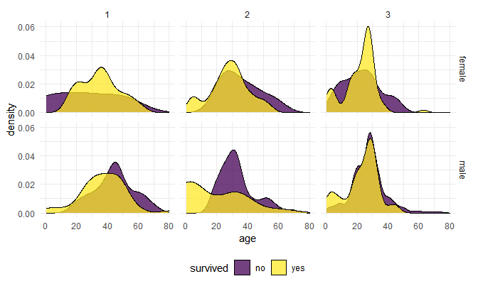

Final Project
================
David Nemirovsky & Jared Klug
5/13/21

## **EDA**

``` r
titanic_df = 
  read_csv("./data/train.csv") %>% 
  janitor::clean_names() %>% 
  mutate(survived = fct_recode(as.factor(survived), yes = "1", no = "0"), 
         pclass = as.factor(pclass), 
         sex = as.factor(sex), 
         embarked = as.factor(embarked))

train_df = 
  titanic_df %>% 
  select(-c(ticket, cabin, name, passenger_id)) %>% 
  drop_na()

#Missing data eda
train_nas = 
  titanic_df %>% 
  select(-c(ticket, cabin, name, passenger_id))

vis_miss(train_nas)
```


``` r
miss_surv = train_nas %>% 
  filter(is.na(age)) %>% 
  group_by(survived) %>% 
  summarise(count = n())

miss_surv
```

    ## # A tibble: 2 x 2
    ##   survived count
    ##   <fct>    <int>
    ## 1 no         125
    ## 2 yes         52

``` r
all_surv = train_df %>% 
  group_by(survived) %>% 
  summarise(count = n())

all_surv 
```

    ## # A tibble: 2 x 2
    ##   survived count
    ##   <fct>    <int>
    ## 1 no         424
    ## 2 yes        288

``` r
#survival percentage in NAs is similar to actual survival rate so assume missingness is not related to outcome,
#will use bagging impute to fill in missing data, embarked will be replaced by the most popular port "S"
train_nas %>% 
  group_by(embarked) %>% 
  summarise(count = n())
```

    ## # A tibble: 4 x 2
    ##   embarked count
    ##   <fct>    <int>
    ## 1 C          168
    ## 2 Q           77
    ## 3 S          644
    ## 4 <NA>         2

``` r
train_nas[is.na(train_nas$embarked),"embarked"] = "S"

trainY = train_nas[1]
trainX = train_nas[-1]

bag_imp = preProcess(trainX, method = "bagImpute")
imp_df = predict(bag_imp, trainX)

train_df = cbind(trainY, imp_df)

tbl_summary(train_df)
```

<!--html_preserve-->

<style>html {
  font-family: -apple-system, BlinkMacSystemFont, 'Segoe UI', Roboto, Oxygen, Ubuntu, Cantarell, 'Helvetica Neue', 'Fira Sans', 'Droid Sans', Arial, sans-serif;
}

#xwocymlrnq .gt_table {
  display: table;
  border-collapse: collapse;
  margin-left: auto;
  margin-right: auto;
  color: #333333;
  font-size: 16px;
  font-weight: normal;
  font-style: normal;
  background-color: #FFFFFF;
  width: auto;
  border-top-style: solid;
  border-top-width: 2px;
  border-top-color: #A8A8A8;
  border-right-style: none;
  border-right-width: 2px;
  border-right-color: #D3D3D3;
  border-bottom-style: solid;
  border-bottom-width: 2px;
  border-bottom-color: #A8A8A8;
  border-left-style: none;
  border-left-width: 2px;
  border-left-color: #D3D3D3;
}

#xwocymlrnq .gt_heading {
  background-color: #FFFFFF;
  text-align: center;
  border-bottom-color: #FFFFFF;
  border-left-style: none;
  border-left-width: 1px;
  border-left-color: #D3D3D3;
  border-right-style: none;
  border-right-width: 1px;
  border-right-color: #D3D3D3;
}

#xwocymlrnq .gt_title {
  color: #333333;
  font-size: 125%;
  font-weight: initial;
  padding-top: 4px;
  padding-bottom: 4px;
  border-bottom-color: #FFFFFF;
  border-bottom-width: 0;
}

#xwocymlrnq .gt_subtitle {
  color: #333333;
  font-size: 85%;
  font-weight: initial;
  padding-top: 0;
  padding-bottom: 4px;
  border-top-color: #FFFFFF;
  border-top-width: 0;
}

#xwocymlrnq .gt_bottom_border {
  border-bottom-style: solid;
  border-bottom-width: 2px;
  border-bottom-color: #D3D3D3;
}

#xwocymlrnq .gt_col_headings {
  border-top-style: solid;
  border-top-width: 2px;
  border-top-color: #D3D3D3;
  border-bottom-style: solid;
  border-bottom-width: 2px;
  border-bottom-color: #D3D3D3;
  border-left-style: none;
  border-left-width: 1px;
  border-left-color: #D3D3D3;
  border-right-style: none;
  border-right-width: 1px;
  border-right-color: #D3D3D3;
}

#xwocymlrnq .gt_col_heading {
  color: #333333;
  background-color: #FFFFFF;
  font-size: 100%;
  font-weight: normal;
  text-transform: inherit;
  border-left-style: none;
  border-left-width: 1px;
  border-left-color: #D3D3D3;
  border-right-style: none;
  border-right-width: 1px;
  border-right-color: #D3D3D3;
  vertical-align: bottom;
  padding-top: 5px;
  padding-bottom: 6px;
  padding-left: 5px;
  padding-right: 5px;
  overflow-x: hidden;
}

#xwocymlrnq .gt_column_spanner_outer {
  color: #333333;
  background-color: #FFFFFF;
  font-size: 100%;
  font-weight: normal;
  text-transform: inherit;
  padding-top: 0;
  padding-bottom: 0;
  padding-left: 4px;
  padding-right: 4px;
}

#xwocymlrnq .gt_column_spanner_outer:first-child {
  padding-left: 0;
}

#xwocymlrnq .gt_column_spanner_outer:last-child {
  padding-right: 0;
}

#xwocymlrnq .gt_column_spanner {
  border-bottom-style: solid;
  border-bottom-width: 2px;
  border-bottom-color: #D3D3D3;
  vertical-align: bottom;
  padding-top: 5px;
  padding-bottom: 6px;
  overflow-x: hidden;
  display: inline-block;
  width: 100%;
}

#xwocymlrnq .gt_group_heading {
  padding: 8px;
  color: #333333;
  background-color: #FFFFFF;
  font-size: 100%;
  font-weight: initial;
  text-transform: inherit;
  border-top-style: solid;
  border-top-width: 2px;
  border-top-color: #D3D3D3;
  border-bottom-style: solid;
  border-bottom-width: 2px;
  border-bottom-color: #D3D3D3;
  border-left-style: none;
  border-left-width: 1px;
  border-left-color: #D3D3D3;
  border-right-style: none;
  border-right-width: 1px;
  border-right-color: #D3D3D3;
  vertical-align: middle;
}

#xwocymlrnq .gt_empty_group_heading {
  padding: 0.5px;
  color: #333333;
  background-color: #FFFFFF;
  font-size: 100%;
  font-weight: initial;
  border-top-style: solid;
  border-top-width: 2px;
  border-top-color: #D3D3D3;
  border-bottom-style: solid;
  border-bottom-width: 2px;
  border-bottom-color: #D3D3D3;
  vertical-align: middle;
}

#xwocymlrnq .gt_from_md > :first-child {
  margin-top: 0;
}

#xwocymlrnq .gt_from_md > :last-child {
  margin-bottom: 0;
}

#xwocymlrnq .gt_row {
  padding-top: 8px;
  padding-bottom: 8px;
  padding-left: 5px;
  padding-right: 5px;
  margin: 10px;
  border-top-style: solid;
  border-top-width: 1px;
  border-top-color: #D3D3D3;
  border-left-style: none;
  border-left-width: 1px;
  border-left-color: #D3D3D3;
  border-right-style: none;
  border-right-width: 1px;
  border-right-color: #D3D3D3;
  vertical-align: middle;
  overflow-x: hidden;
}

#xwocymlrnq .gt_stub {
  color: #333333;
  background-color: #FFFFFF;
  font-size: 100%;
  font-weight: initial;
  text-transform: inherit;
  border-right-style: solid;
  border-right-width: 2px;
  border-right-color: #D3D3D3;
  padding-left: 12px;
}

#xwocymlrnq .gt_summary_row {
  color: #333333;
  background-color: #FFFFFF;
  text-transform: inherit;
  padding-top: 8px;
  padding-bottom: 8px;
  padding-left: 5px;
  padding-right: 5px;
}

#xwocymlrnq .gt_first_summary_row {
  padding-top: 8px;
  padding-bottom: 8px;
  padding-left: 5px;
  padding-right: 5px;
  border-top-style: solid;
  border-top-width: 2px;
  border-top-color: #D3D3D3;
}

#xwocymlrnq .gt_grand_summary_row {
  color: #333333;
  background-color: #FFFFFF;
  text-transform: inherit;
  padding-top: 8px;
  padding-bottom: 8px;
  padding-left: 5px;
  padding-right: 5px;
}

#xwocymlrnq .gt_first_grand_summary_row {
  padding-top: 8px;
  padding-bottom: 8px;
  padding-left: 5px;
  padding-right: 5px;
  border-top-style: double;
  border-top-width: 6px;
  border-top-color: #D3D3D3;
}

#xwocymlrnq .gt_striped {
  background-color: rgba(128, 128, 128, 0.05);
}

#xwocymlrnq .gt_table_body {
  border-top-style: solid;
  border-top-width: 2px;
  border-top-color: #D3D3D3;
  border-bottom-style: solid;
  border-bottom-width: 2px;
  border-bottom-color: #D3D3D3;
}

#xwocymlrnq .gt_footnotes {
  color: #333333;
  background-color: #FFFFFF;
  border-bottom-style: none;
  border-bottom-width: 2px;
  border-bottom-color: #D3D3D3;
  border-left-style: none;
  border-left-width: 2px;
  border-left-color: #D3D3D3;
  border-right-style: none;
  border-right-width: 2px;
  border-right-color: #D3D3D3;
}

#xwocymlrnq .gt_footnote {
  margin: 0px;
  font-size: 90%;
  padding: 4px;
}

#xwocymlrnq .gt_sourcenotes {
  color: #333333;
  background-color: #FFFFFF;
  border-bottom-style: none;
  border-bottom-width: 2px;
  border-bottom-color: #D3D3D3;
  border-left-style: none;
  border-left-width: 2px;
  border-left-color: #D3D3D3;
  border-right-style: none;
  border-right-width: 2px;
  border-right-color: #D3D3D3;
}

#xwocymlrnq .gt_sourcenote {
  font-size: 90%;
  padding: 4px;
}

#xwocymlrnq .gt_left {
  text-align: left;
}

#xwocymlrnq .gt_center {
  text-align: center;
}

#xwocymlrnq .gt_right {
  text-align: right;
  font-variant-numeric: tabular-nums;
}

#xwocymlrnq .gt_font_normal {
  font-weight: normal;
}

#xwocymlrnq .gt_font_bold {
  font-weight: bold;
}

#xwocymlrnq .gt_font_italic {
  font-style: italic;
}

#xwocymlrnq .gt_super {
  font-size: 65%;
}

#xwocymlrnq .gt_footnote_marks {
  font-style: italic;
  font-size: 65%;
}
</style>

<div id="xwocymlrnq" style="overflow-x:auto;overflow-y:auto;width:auto;height:auto;">

<table class="gt_table">

<thead class="gt_col_headings">

<tr>

<th class="gt_col_heading gt_columns_bottom_border gt_left" rowspan="1" colspan="1">

<strong>Characteristic</strong>

</th>

<th class="gt_col_heading gt_columns_bottom_border gt_center" rowspan="1" colspan="1">

<strong>N = 891</strong><sup class="gt_footnote_marks">1</sup>

</th>

</tr>

</thead>

<tbody class="gt_table_body">

<tr>

<td class="gt_row gt_left">

survived

</td>

<td class="gt_row gt_center">

342 (38%)

</td>

</tr>

<tr>

<td class="gt_row gt_left">

pclass

</td>

<td class="gt_row gt_center">

</td>

</tr>

<tr>

<td class="gt_row gt_left" style="text-align: left; text-indent: 10px;">

1

</td>

<td class="gt_row gt_center">

216 (24%)

</td>

</tr>

<tr>

<td class="gt_row gt_left" style="text-align: left; text-indent: 10px;">

2

</td>

<td class="gt_row gt_center">

184 (21%)

</td>

</tr>

<tr>

<td class="gt_row gt_left" style="text-align: left; text-indent: 10px;">

3

</td>

<td class="gt_row gt_center">

491 (55%)

</td>

</tr>

<tr>

<td class="gt_row gt_left">

sex

</td>

<td class="gt_row gt_center">

</td>

</tr>

<tr>

<td class="gt_row gt_left" style="text-align: left; text-indent: 10px;">

female

</td>

<td class="gt_row gt_center">

314 (35%)

</td>

</tr>

<tr>

<td class="gt_row gt_left" style="text-align: left; text-indent: 10px;">

male

</td>

<td class="gt_row gt_center">

577 (65%)

</td>

</tr>

<tr>

<td class="gt_row gt_left">

age

</td>

<td class="gt_row gt_center">

28 (22, 36)

</td>

</tr>

<tr>

<td class="gt_row gt_left">

sib\_sp

</td>

<td class="gt_row gt_center">

</td>

</tr>

<tr>

<td class="gt_row gt_left" style="text-align: left; text-indent: 10px;">

0

</td>

<td class="gt_row gt_center">

608 (68%)

</td>

</tr>

<tr>

<td class="gt_row gt_left" style="text-align: left; text-indent: 10px;">

1

</td>

<td class="gt_row gt_center">

209 (23%)

</td>

</tr>

<tr>

<td class="gt_row gt_left" style="text-align: left; text-indent: 10px;">

2

</td>

<td class="gt_row gt_center">

28 (3.1%)

</td>

</tr>

<tr>

<td class="gt_row gt_left" style="text-align: left; text-indent: 10px;">

3

</td>

<td class="gt_row gt_center">

16 (1.8%)

</td>

</tr>

<tr>

<td class="gt_row gt_left" style="text-align: left; text-indent: 10px;">

4

</td>

<td class="gt_row gt_center">

18 (2.0%)

</td>

</tr>

<tr>

<td class="gt_row gt_left" style="text-align: left; text-indent: 10px;">

5

</td>

<td class="gt_row gt_center">

5 (0.6%)

</td>

</tr>

<tr>

<td class="gt_row gt_left" style="text-align: left; text-indent: 10px;">

8

</td>

<td class="gt_row gt_center">

7 (0.8%)

</td>

</tr>

<tr>

<td class="gt_row gt_left">

parch

</td>

<td class="gt_row gt_center">

</td>

</tr>

<tr>

<td class="gt_row gt_left" style="text-align: left; text-indent: 10px;">

0

</td>

<td class="gt_row gt_center">

678 (76%)

</td>

</tr>

<tr>

<td class="gt_row gt_left" style="text-align: left; text-indent: 10px;">

1

</td>

<td class="gt_row gt_center">

118 (13%)

</td>

</tr>

<tr>

<td class="gt_row gt_left" style="text-align: left; text-indent: 10px;">

2

</td>

<td class="gt_row gt_center">

80 (9.0%)

</td>

</tr>

<tr>

<td class="gt_row gt_left" style="text-align: left; text-indent: 10px;">

3

</td>

<td class="gt_row gt_center">

5 (0.6%)

</td>

</tr>

<tr>

<td class="gt_row gt_left" style="text-align: left; text-indent: 10px;">

4

</td>

<td class="gt_row gt_center">

4 (0.4%)

</td>

</tr>

<tr>

<td class="gt_row gt_left" style="text-align: left; text-indent: 10px;">

5

</td>

<td class="gt_row gt_center">

5 (0.6%)

</td>

</tr>

<tr>

<td class="gt_row gt_left" style="text-align: left; text-indent: 10px;">

6

</td>

<td class="gt_row gt_center">

1 (0.1%)

</td>

</tr>

<tr>

<td class="gt_row gt_left">

fare

</td>

<td class="gt_row gt_center">

14 (8, 31)

</td>

</tr>

<tr>

<td class="gt_row gt_left">

embarked

</td>

<td class="gt_row gt_center">

</td>

</tr>

<tr>

<td class="gt_row gt_left" style="text-align: left; text-indent: 10px;">

C

</td>

<td class="gt_row gt_center">

168 (19%)

</td>

</tr>

<tr>

<td class="gt_row gt_left" style="text-align: left; text-indent: 10px;">

Q

</td>

<td class="gt_row gt_center">

77 (8.6%)

</td>

</tr>

<tr>

<td class="gt_row gt_left" style="text-align: left; text-indent: 10px;">

S

</td>

<td class="gt_row gt_center">

646 (73%)

</td>

</tr>

</tbody>

<tfoot>

<tr class="gt_footnotes">

<td colspan="2">

<p class="gt_footnote">

<sup class="gt_footnote_marks"> <em>1</em> </sup>

Statistics presented: n (%); Median (IQR) <br />

</p>

</td>

</tr>

</tfoot>

</table>

</div>

<!--/html_preserve-->

``` r
featurePlot(x = select(mutate(train_df, 
                              pclass = as.numeric(pclass), 
                              sex = as.numeric(sex),
                              embarked = as.numeric(embarked)),
                       pclass:embarked), 
            y = train_df$survived,
            scales = list(x = list(relation = "free"), 
                          y = list(relation = "free")),
            plot = "density", 
            auto.key = list(columns = 2))
```


``` r
train_df %>% 
  ggplot(aes(x = age, fill = survived)) +
  geom_density(alpha = 0.75) + 
  facet_grid(sex ~ pclass)
```



``` r
train_df %>% 
  filter(fare < 100) %>% 
  ggplot(aes(x = fare, fill = survived)) +
  geom_density(alpha = 0.75) + 
  facet_grid(sex ~ pclass)
```


``` r
train_df %>% 
  #filter(fare < 100) %>% 
  ggplot(aes(x = age, y = fare, color = survived)) +
  geom_point(alpha = 0.75) + 
  facet_grid(sex ~ pclass)
```


``` r
train_df %>% 
  ggplot(aes(x = age, fill = survived)) + 
  geom_density(alpha = 0.75) + 
  facet_grid(sex ~ embarked)
```


``` r
train_df %>% 
  #filter(fare < 100) %>% 
  ggplot(aes(x = age, y = fare, color = survived)) +
  geom_point(alpha = 0.75) + 
  facet_grid(sex ~ embarked)
```


## **Model Training**

``` r
ctrl = trainControl(method = "repeatedcv", summaryFunction = twoClassSummary, classProbs = T, number = 10, repeats = 5)

set.seed(37564)
mod_enet = train(survived ~ .,
                 na.action = na.exclude, 
                 data = train_df, 
                 method = "glmnet", 
                 family = "binomial", 
                 metric = "ROC", 
                 tuneGrid = expand.grid(alpha = seq(0, 0.5, length = 6), 
                                        lambda = exp(seq(-4, -8, length = 50))),
                 trControl = ctrl)
tuning_plot_enet = 
  ggplot(mod_enet, highlight = T) + 
  ggtitle("Elastic Net") +
  theme(plot.title = element_text(hjust = 0.5))
mod_enet$bestTune
```

    ##     alpha      lambda
    ## 165   0.3 0.001051915

``` r
set.seed(37564)
mod_mars = train(survived ~ ., 
                 na.action = na.exclude, 
                 data = train_df, 
                 method = "earth",
                 tuneGrid = expand.grid(degree = 1:3, nprune = 5:15), 
                 metric = "ROC", 
                 trControl = ctrl)
tuning_plot_mars = 
  ggplot(mod_mars, highlight = T) + 
  ggtitle("MARS") +
  theme(plot.title = element_text(hjust = 0.5))
mod_mars$bestTune
```

    ##    nprune degree
    ## 18     11      2

``` r
set.seed(37564)
mod_knn = train(survived ~ .,
                na.action = na.exclude, 
                data = train_df, 
                method = "knn",
                metric = "ROC", 
                preProcess = c("center","scale"),
                tuneGrid = data.frame(k = seq(1, 30, by = 1)), 
                trControl = ctrl)
tuning_plot_knn = 
  ggplot(mod_knn, highlight = T) + 
  ggtitle("KNN") +
  theme(plot.title = element_text(hjust = 0.5))
mod_knn$bestTune
```

    ##   k
    ## 8 8

``` r
set.seed(37564)
mod_boost = train(survived ~ .,
                  na.action = na.exclude,
                  data = train_df,
                  method = "gbm",
                  distribution = "adaboost",
                  tuneGrid = expand.grid(n.trees = c(2000, 3000),
                                         interaction.depth = 3:10,
                                         shrinkage = c(0.005, 0.007, 0.009), 
                                         n.minobsinnode = 1),
                  metric = "ROC",
                  trControl = ctrl,
                  verbose = F)
tuning_plot_boost = 
  ggplot(mod_boost, highlight = T) + 
  ggtitle("Boosting") +
  theme(plot.title = element_text(hjust = 0.5))
mod_boost$bestTune
```

    ##    n.trees interaction.depth shrinkage n.minobsinnode
    ## 15    2000                10     0.005              1

``` r
set.seed(37564)
mod_svm = train(survived ~ .,
                na.action = na.exclude,
                data = train_df,
                preProcess = c("scale", "center"),
                method = "svmRadialSigma",
                tuneGrid = expand.grid(C = exp(seq(-2,3, len = 10)),
                                       sigma = exp(seq(-8,0, len = 10))),
                metric = "ROC",
                trControl = ctrl)
tuning_plot_svm = 
  ggplot(mod_svm, highlight = T) + 
  ggtitle("SVM Radial") +
  theme(plot.title = element_text(hjust = 0.5))
mod_svm$bestTune
```

    ##        sigma        C
    ## 76 0.0285655 6.612018

``` r
(tuning_plot_knn + tuning_plot_svm + tuning_plot_enet) / (tuning_plot_mars + tuning_plot_boost)
```


``` r
res = resamples(list(ENET = mod_enet, MARS = mod_mars, KNN = mod_knn, BOOST = mod_boost, SVM = mod_svm))
summary(res)
```

    ## 
    ## Call:
    ## summary.resamples(object = res)
    ## 
    ## Models: ENET, MARS, KNN, BOOST, SVM 
    ## Number of resamples: 50 
    ## 
    ## ROC 
    ##            Min.   1st Qu.    Median      Mean   3rd Qu.      Max. NA's
    ## ENET  0.7545455 0.8311497 0.8562834 0.8523355 0.8815699 0.9208556    0
    ## MARS  0.7804813 0.8408709 0.8704793 0.8659702 0.8903839 0.9415584    0
    ## KNN   0.8080214 0.8431723 0.8644038 0.8685563 0.8882659 0.9532086    0
    ## BOOST 0.7983957 0.8614973 0.8815508 0.8806867 0.9012032 0.9513369    0
    ## SVM   0.7812834 0.8322193 0.8629283 0.8603161 0.8828209 0.9294118    0
    ## 
    ## Sens 
    ##            Min.   1st Qu.    Median      Mean   3rd Qu.      Max. NA's
    ## ENET  0.8000000 0.8363636 0.8727273 0.8648418 0.8909091 0.9454545    0
    ## MARS  0.6909091 0.8363636 0.8727273 0.8692054 0.8909091 0.9636364    0
    ## KNN   0.7777778 0.8545455 0.8727273 0.8790034 0.9090909 0.9636364    0
    ## BOOST 0.8000000 0.8888889 0.9090909 0.9063771 0.9454545 0.9636364    0
    ## SVM   0.8545455 0.9090909 0.9272727 0.9253333 0.9454545 1.0000000    0
    ## 
    ## Spec 
    ##            Min.   1st Qu.    Median      Mean   3rd Qu.      Max. NA's
    ## ENET  0.5588235 0.6619748 0.7058824 0.7052437 0.7409664 0.8529412    0
    ## MARS  0.5882353 0.6764706 0.7058824 0.7156975 0.7714286 0.9117647    0
    ## KNN   0.5588235 0.6470588 0.6957983 0.6983193 0.7592437 0.9117647    0
    ## BOOST 0.5588235 0.6470588 0.7058824 0.7059664 0.7647059 0.9117647    0
    ## SVM   0.4705882 0.6176471 0.6668067 0.6608235 0.7058824 0.8529412    0

``` r
bwplot(res, metric = "ROC", main = "ROC for Repeated 10-Fold CV Using Various Models")
```


## **Variable Importance**

``` r
set.seed(37564)

vip(mod_boost, 
    method = "permute", 
    train = train_df,
    target = "survived",
    metric = "auc",
    reference_class = c("yes", "no"),
    nsim = 30,
    pred_wrapper = predict,
    geom = "boxplot", 
    all_permutations = T,
    mapping = aes_string(fill = "Variable", alpha = 0.75))
```


## **Predictions**

``` r
set.seed(37564)

testna_df = 
  read_csv("./data/test.csv") %>% 
  janitor::clean_names() %>% 
  mutate(pclass = as.factor(pclass), 
         sex = as.factor(sex), 
         embarked = as.factor(embarked)) %>% 
  select(-c(ticket, cabin, name)) %>% 
  left_join(janitor::clean_names(read_csv("./data/titanic_results.csv")))

testX = testna_df[-1]
bag_imp = preProcess(testX, method = "bagImpute")
test_df = predict(bag_imp, testX)

pred_knn = predict(mod_knn, newdata = test_df, type = "prob")[,1]
roc_knn = roc(test_df$survived, pred_knn)
plot(roc_knn, legacy.axes = T)

pred_enet = predict(mod_enet, newdata = test_df, type = "prob")[,1]
roc_enet = roc(test_df$survived, pred_enet)
plot(roc_enet, add = T, col = 2)

pred_svm = predict(mod_svm, newdata = test_df, type = "prob")[,1]
roc_svm = roc(test_df$survived, pred_svm)
plot(roc_svm, add = T, col = 3)

pred_mars = predict(mod_mars, newdata = test_df, type = "prob")[,1]
roc_mars = roc(test_df$survived, pred_mars)
plot(roc_mars, add = T, col = 4)

pred_boost = predict(mod_boost, newdata = test_df, type = "prob")[,1]
roc_boost = roc(test_df$survived, pred_boost)
auc = c(roc_knn$auc[1], roc_enet$auc[1], roc_svm$auc[1], roc_mars$auc[1], roc_boost$auc[1])
modelNames = c("KNN","Elastic Net", "SVM", "MARS", "Boosting")
legend("bottomright", legend = paste0(modelNames, ": ", round(auc,3)),
       col = c(1:4, 7), lwd = 2)
plot(roc_boost, add = T, col = 7)
```


